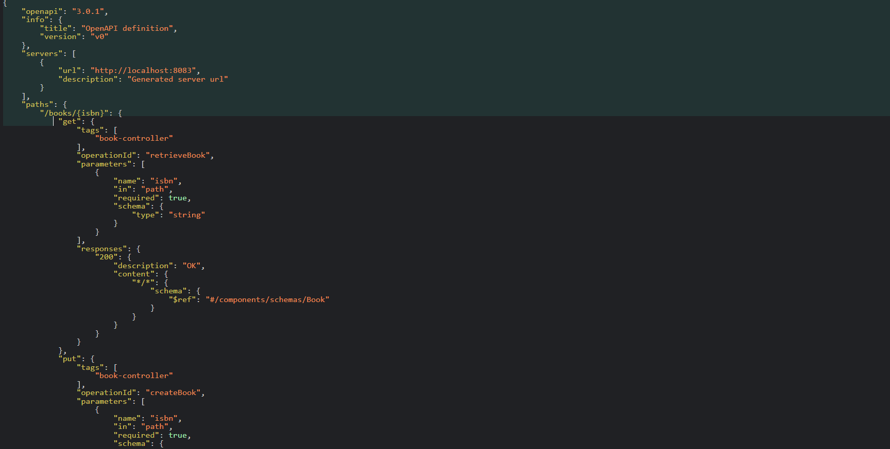

# Books REST API

## Overview

The Books REST API is a Spring Boot application that provides a RESTful interface for managing books. It allows you to perform CRUD operations (Create, Read, Update, Delete) on book records.

## Features

- **Create**: Add a new book to the system.
- **Read**: Retrieve details of a specific book or list all books.
- **Update**: Update the details of an existing book.
- **Delete**: Remove a book from the system.

## Getting Started

To get started with this project, follow these instructions to set up and run the application on your local machine.

### Prerequisites

- **Java 11 or higher**: The project is built using Java 11.
- **Maven**: Apache Maven 3.6.0 or higher is required for building and running the project.

### Clone the Repository

Clone the repository to your local machine:

```sh
git clone https://github.com/HarshMN2345/Books_REST.git
cd Books_REST
mvn clean install
mvn spring-boot:run

you can view api-docs at http://localhost:8083/api-docs
```
